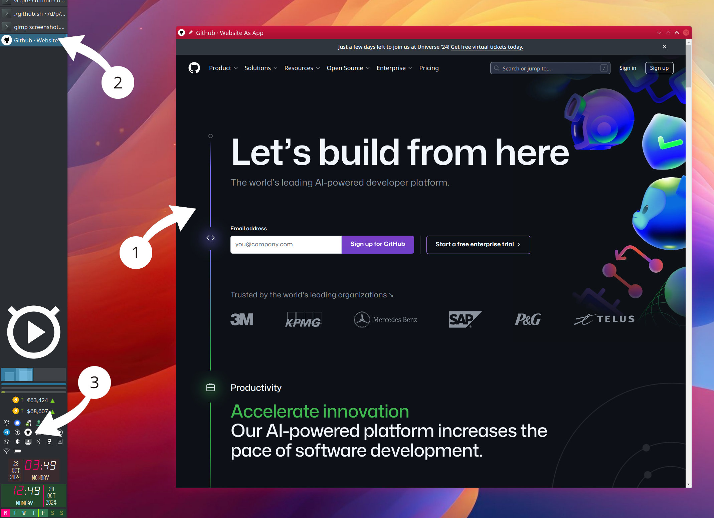

# WebApp

Run any website as standalone desktop application

## What is it?

This tool offers a unique approach to web browsing by opening any webpage in a dedicated
window using the embedded QT WebEngine. By removing the typical browser UI elements, it effectively
turns websites into standalone desktop applications. This can be particularly useful if you've ever
wished to run a frequently used website as a separate app, independent from your main browser.

It provides a practical solution for those who find themselves juggling numerous browser tabs
or wanting a clearer separation between work and personal web applications. With each website
running as its own "app", you gain the benefit of individual entries in your window manager or task
switcher, potentially improving your workflow organization and efficiency.

1. Github website running as standalone app
2. Own application entry in the task switcher
3. Dedicated entry in system tray menu for easy access

Whether you're looking to streamline your digital workspace or simply curious about alternative
ways to interact with web content, this script presents an interesting concept that might just
solve a problem you didn't know you had.

## How to start?

Please refer to the [documentation](docs/README.md) for detailed instructions on how to
quickly install and start using this tool.

## License

* Written and copyrighted &copy;2023-2024 by Marcin Orlowski <mail (#) marcinorlowski (.) com>
* ResponseBuilder is open-sourced software licensed under
  the [MIT license](http://opensource.org/licenses/MIT)
